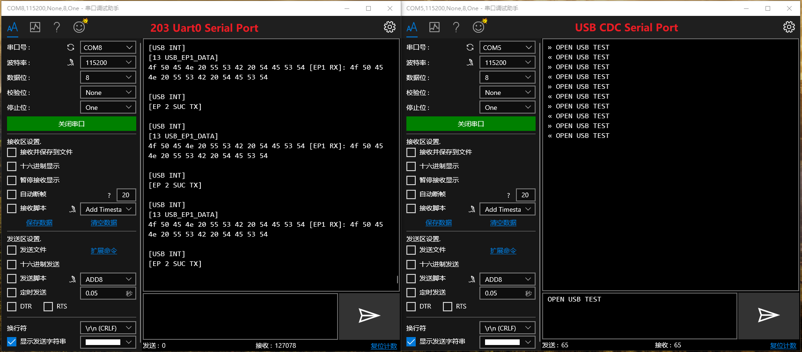
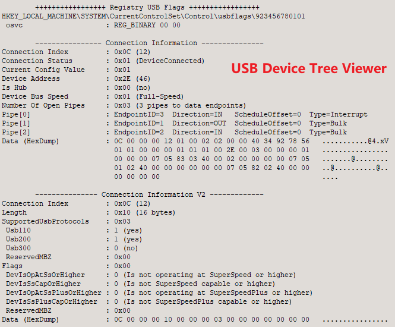

# README

# Hardware

## USB2.0 Device Controller IP Core

This component is a simple USB Peripheral Interface (Device) implementation with an AHB/ICB slave register interface, and with a ULPI interface for connection to a USB PHY.

## Features

- USB 2.0 Device mode support.
- AHB and ICB (Internal Chip Bus) slave register interfaces are supported (ICB interface is used by **[Hummingbird E203](https://github.com/riscv-mcu/e203_hbirdv2)**).
- The number of endpoints can be configured (At least 1, 4 by default).
- Support scaledown mode for simulation.

## ****Limitations (It will be optimized later)****

- Currently, only FS (12Mbit/s) mode is supported, and HS (480Mbit/s) mode is not supported.
- Suspend and Wakeup are not supported.
- DMA is not supported.

## Architecture

## Register Map

| Offset | Name | Description |
| --- | --- | --- |
| 0x0000 | USB_FUNC_CTRL | [RW] Control Register |
| 0x0004 | USB_FUNC_STAT | [RW] Status Register |
| 0x0008 | USB_FUNC_ADDR | [RW] Address Register |
| 0x000C | USB_EP_INTSTS | [RW] Endpoint interrupt status Register |
| 0x0020+0x20*i (0≤i≤15) | USB_EPi_CFG | [RW] Endpoint i Configuration |
| 0x0024+0x20*i (0≤i≤15) | USB_EPi_TX_CTRL | [RW] Endpoint i Tx Control |
| 0x0028+0x20*i (0≤i≤15) | USB_EPi_RX_CTRL | [W] Endpoint i Rx Control |
| 0x002C+0x20*i (0≤i≤15) | USB_EPi_STS | [R] Endpoint i status |
| 0x0030+0x20*i (0≤i≤15) | USB_EPi_DATA | [RW] Endpoint i Data FIFO |

### REG: USB_FUNC_CTRL

| Bits | Name | Description |
| --- | --- | --- |
| 8 | HS_CHIRP_EN | High-speed Chirp Enable |
| 7 | PHY_DMPULLDOWN | UTMI PHY D+ Pulldown Enable |
| 6 | PHY_DPPULLDOWN | UTMI PHY D+ Pulldown Enable |
| 5 | PHY_TERMSELECT | UTMI PHY Termination Select |
| 4:3 | PHY_XCVRSELECT | UTMI PHY Transceiver Select |
| 2:1 | PHY_OPMODE | UTMI PHY Output Mode |
| 0 | INT_EN_SOF | Interrupt enable - SOF reception |

### REG: USB_FUNC_STAT

| Bits | Name | Description |
| --- | --- | --- |
| 13 | RST | USB Reset Detected (cleared on write) |
| 12:11 | LINESTATE | USB line state (bit 1 = D+, bit 0 = D-) |
| 10:0 | FRAME | Frame number |

### REG: USB_FUNC_ADDR

| Bits | Name | Description |
| --- | --- | --- |
| 6:0 | DEV_ADDR | Device address |

### REG: USB_EP_INTSTS

This register is mainly convenient for software implementation of interrupt control. When the endpoint status register already exists, the appearance of this register is not very concise, and it will be optimized later.

| Bits | Name | Description |
| --- | --- | --- |
| 0 | EP0_RX_READY | Receive ready (data available) When interrupt on EP0 Rx ready is enable , the bit will generate the interrupt, and this interrupt can be cleared by writing 1 to the bit. |
| 1 | EP1_RX_READY | Receive ready (data available) When interrupt on EP1 Rx ready is enable , the bit will generate the interrupt, and this interrupt can be cleared by writing 1 to the bit. |
| … | … | … |
| 16 | EP0_TX_COMPLETE | Tx complete When interrupt on EP0 Tx complete is enable , the bit will generate the interrupt, and this interrupt can be cleared by writing 1 to the bit. |
| 17 | EP1_TX_COMPLETE | Tx complete When interrupt on EP1 Tx complete is enable , the bit will generate the interrupt, and this interrupt can be cleared by writing 1 to the bit. |
| … | … | … |

### REG: USB_EP*i*_CFG

| Bits | Name | Description |
| --- | --- | --- |
| 3 | INT_RX | Interrupt enable on Rx ready |
| 2 | INT_TX | Interrupt enable on Tx complete |
| 1 | STALL_EP | Stall endpoint |
| 0 | ISO | Isochronous endpoint |

### REG: USB_EP*i*_TX_CTRL

| Bits | Name | Description |
| --- | --- | --- |
| 17 | TX_FLUSH | Invalidate Tx buffer |
| 16 | TX_START | Transmit start - enable transmit of endpoint data |
| 10:0 | TX_LEN | Transmit length |

### REG: USB_EP*i*_RX_CTRL

| Bits | Name | Description |
| --- | --- | --- |
| 1 | RX_FLUSH | Invalidate Rx buffer |
| 0 | RX_ACCEPT | Receive data accepted (read) |

### REG: USB_EP*i*_STS

| Bits | Name | Description |
| --- | --- | --- |
| 20 | TX_ERR | Transmit error (buffer underrun) |
| 19 | TX_BUSY | Transmit busy (active) |
| 18 | RX_ERR | Receive error - CRC mismatch or buffer overflow |
| 17 | RX_SETUP | SETUP request received |
| 16 | RX_READY | Receive ready (data available) |
| 10:0 | RX_COUNT | Endpoint received length (RD) |

### REG: USB_EP*i*_DATA

| Bits | Name | Description |
| --- | --- | --- |
| 7:0 | DATA | Read or write from Rx or Tx endpoint FIFO |

# Software

Provided with a `USB-CDC` test stack `(USB Serial port`) with loopback/echo example. 

To make this functional on your platform:

- Set `USB_BASE` to the correct address for the peripheral.
- Implement your interrupt enable and service function, according to `main.c`.
- Implement `_delay_us` and `_delay_ms` function in `openusb_common.c`.
- Uncomment `DEBUG_MODE` and `LOG_SETUP_PACKET` in `openusb_defs.h` for debugging printing.

# Test

Verified under simulation then tested on FPGA as a USB-CDC mode peripheral (USB serial port) against Windows PCs.

- Integrated to E203 SoC through ICB interface, using MCU200T FPGA development board and USB3300 PHY.
- Integrated to another RISC-V SoC through AHB interface, using MCU200T FPGA development board and USB3300 PHY.

Tips: If Windows cannot recongnize the device, you need to update its driver manually.

## Tools

The tools used in the test and debug as follows:

- USBDeviceTreeViewer
- EltimaUSBAnalzyer
- HHD device Monitoring Studio
- BusHound
- Serial port debugging assistant

# References

This work is developed on the basis of [ultra-embedded](https://github.com/ultraembedded/cores), including its hardware and software design. I just adjust and optimize it to improve its usability.

- [USB 2.0 Specification](https://usb.org/developers/docs/usb20_docs)
- [UTMI Specification](https://www.intel.com/content/dam/www/public/us/en/documents/technical-specifications/usb2-transceiver-macrocell-interface-specification.pdf)
- [USB Made Simple](http://www.usbmadesimple.co.uk/)
- [UTMI to ULPI Conversion](https://github.com/ultraembedded/cores/tree/master/ulpi_wrapper)